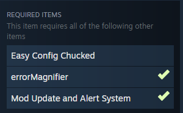

  

## 🛠️ How to Use

Some images to help you: https://imgur.com/a/dabGiKW

1. **Initial Setup:** Open the settings and configure the correct folder locations.
2. **Mod Activation:** If the mods do not appear automatically, check the **Uninstalled** list and activate them.
3. **Automatic Configuration:** Once the mods appear in your **Active List**, the `servertest.ini` file will be automatically configured.
4. **Advanced Adjustments:** You can perform fine-tuning within the **Enhance Mod** panel.
   > ⚠️ **NOTICE:** Not recommended for new players. Ensure you understand the basic mechanics first.
5. **Presets Management:** * Click on **PRESET** to create a new one or import an existing file (e.g., `HellDrinx FULL [42_16+] - v2_0_1.ini`).
   * **FULL Import:** Complete overwrite (Copy & Paste).
   * **SOFT Import:** Updates only `Mods=`, `Map=`, and `WorkshopItems=`, preserving your specific server configurations.
6. **Safety First:** Always generate a **BACKUP** before performing any experimental changes!
---
> **💡 Tip:** You can click the icon next to the mod to open its Steam Workshop page. Check the right-hand sidebar on Steam to see if that mod has any mandatory dependencies.
> 

---

## 🛠️ Understanding the list:

* **Uninstalled Tab**: Always displays mods that are **DOWNLOADED** but **NOT ACTIVATED** on the server.
* **Active Tab**: Displays mods that are downloaded and currently **ENABLED** in your server configuration.

In the **Active** list, click **REMOVE** to send a mod to the **Uninstalled** list. Conversely, click **ACTIVATE** in the **Uninstalled** list to add it to your server.

### Auto-Sorting ⚡
The assistant analyzes each mod's dependencies and ensures your `servertest.ini` has the **PERFECT** load order, preventing crashes and compatibility errors.

---

## 💎 Credits and Support
Developed by **augusto-developer** with authorization to use the **HellDrinx** trademark, for the global Project Zomboid community.

  

